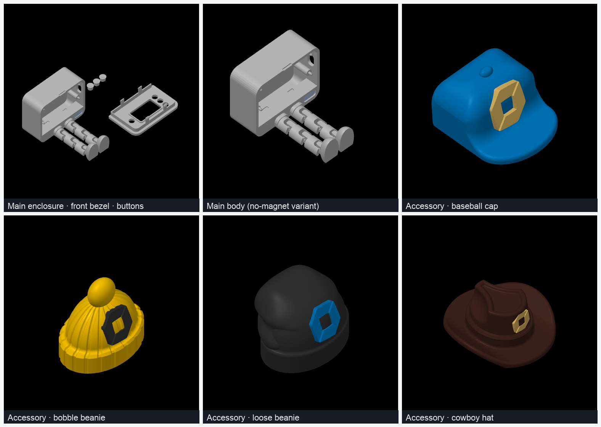
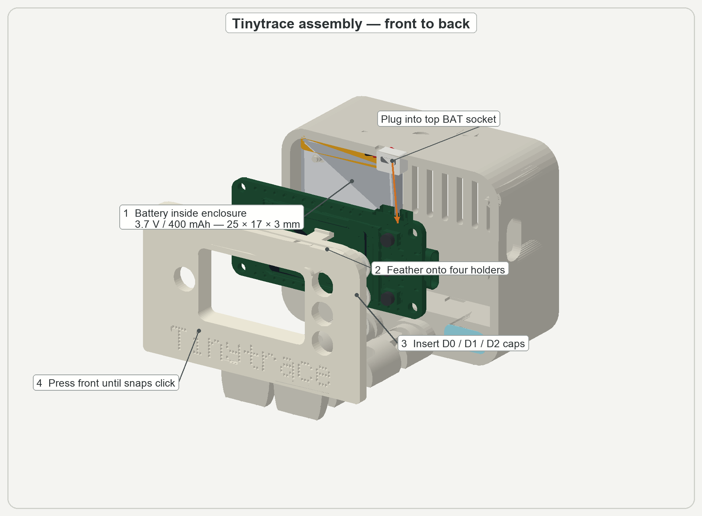

# Tinytrace enclosure — v35

A magnetic-mount case for the **Adafruit ESP32-S3 Reverse TFT Feather**, plus a
pack of snap-on magnetic hats. Authored as a **Bambu Studio** project
([`Tinytrace_v35_print_plate.3mf`](Tinytrace_v35_print_plate.3mf)) — 8 parts
laid out across 6 print plates, ready to slice.

## Assembly — front to back

## Parts

| Part | Plate | Notes |
|---|---|---|
| **Main body — magnetic mount** | 1 | body + transparent IO window; tree-organic supports |
| **Front bezel** | 1 | faceplate over the 1.14" display |
| **3D button caps** ×3 | 1 | D0 / D1 / D2 |
| **Main body — no-magnet variant** | 2 | plain body without the mount magnets |
| **Baseball cap** | 3 | magnetic accessory + Dynatrace logo |
| **Bobble beanie** | 4 | magnetic accessory + Dynatrace logo |
| **Loose beanie** | 5 | magnetic accessory + Dynatrace logo |
| **Cowboy hat** | 6 | magnetic accessory + Dynatrace logo |

Each hat conceals a magnet and clips onto the mount body; the logo and accents
are separate-colour parts printed in the same job.

## Magnets

Both halves of the magnetic coupling take a **3 × 1 mm neodymium disc magnet**
(3 mm diameter, 1 mm thick): one in the mount body, and one in each hat you
print. The magnets are dropped in mid-print at a **print pause** (see below) and
sealed over by the following layers — no glue needed.

> ⚠ **Mind the polarity.** The magnet in a hat must *attract* the one in the
> mount body — seat them with opposite poles facing out, or the hat will push
> off instead of snapping on.

## Printing

Sliced for a **Bambu Lab H2C**, 0.4 mm nozzle, from the bundled project:

| | |
|---|---|
| Layer height | 0.16 mm |
| Walls / infill | 2 walls · 15 % sparse |
| Supports | tree (organic), auto, on build plate only — main enclosure |
| Bed | textured plate |
| Material | PLA (Matte / Basic), **PLA Translucent** for the IO window, PLA Wood accent, **TPU 90A** |
| Colour | multi-material (per-part filament map) — logos and accents print in the same job |

**Print pauses — insert a magnet.** The magnetic plates stop mid-print so you can
drop the disc magnet into its pocket before it's enclosed:

| Plate | Pause | Action |
|---|---|---|
| Main body — magnetic mount (plate 1) | **layer 286** | seat one 3 × 1 mm magnet, resume |
| Each hat (plates 3–6) | **layer 9** | seat one 3 × 1 mm magnet, resume |

Open the `.3mf` in Bambu Studio / OrcaSlicer to inspect per-plate filament maps
and the pause layers.

## Renders

[`renders/`](renders/) holds:

- `00_assembly_build_guide.png` — annotated front-to-back assembly guide
  (battery → Feather → button caps → snap-on front).
- `overview.png` — labelled contact sheet of all six print plates.
